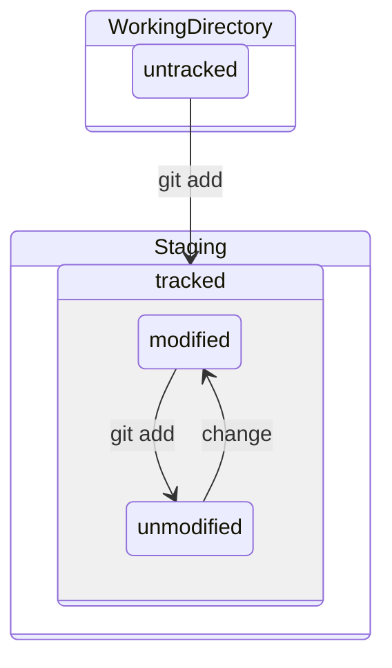

> # Today, I learned :grin:

# 기본 구조


- 공동작업
- 실수로 파일을 지우거나 옮겼을 때

## 1. git 구조

### 1) Working Driectory : Folder

우리가 흔히들 사용하는 OS의 폴더이다. 해당 폴더의 `git init` 명령어를 실행하면 해당폴더에 .git이라는 폴더가 생성된다. 단순히 소스코드 뿐만이 아니라 문서, 이미지, 영상 등 모든 파일의 생성, 수정, 삭제 히스토리를 git에서는 관리하고 복구해준다.

```bash
# .gitignore 파일은 main에서 만들어주는게 좋음
# branch에서 작업이 끝나기 전까지는 무조건 commit을 해두는게 좋음 - main branch에서 안보임
# stash는 master branch에서 사용하는 경우가 많음
```

### 2) Staging : File

git에서 staging이란 최종적인 commit 전 파일의 변경사항을 추적할 수 있도록 메타정보를 git에 등록해주는 과정이라고 볼 수 있다. 한번 등록된 파일은 변경사항의 유무에 따라 track(추적)을 할 수 있다.



- untracked 된 파일을 git add 하면 tracked & unmodified 상태가 됨
- 파일을 수정 시 tracked & unmodified 가 tracked & modified 상태가 됨

```bash
# Working Directory에서 Staging으로 파일 추가
git add [file_name]

# Untracked인 파일과 Modified & Tracked 된 파일 모두 추가
git add .
git add -A
git add --all

# untracked와 tracked된 파일 확인
# untracked된 파일은 나오지 않음
git ls-files

# unmodifited와 modified 파일 상태 확인
git status
```

#### A. Untracked : 변경사항이 추적안되는 파일

#### B. Tracked : 변경사항이 추적되는 파일

- unmodified : 변경이 없는 파일
- modified : 변경된 파일

### 3) Repository : Folder

#### A. Local Repository

컴퓨터 안에 git 시스템에서 최종적으로 commit된 파일이 올라가는 공간이다. branch에 따라 tracked 파일과 untracked 파일이 다를 수 있다?

```bash
# Local Repo에 commit
git commit -m "[commit_message]"
```

#### B. Remote Repository

git 시스템에서 repo는 remote와 local이 있다. 최종적으로 commit을 하면 local repo에 staging된 파일들이 저장되고 push를 하면 서버에 백업하는 개념으로 local repo에 commit된 파일이 remote repo로 올라간다.

```bash
# Remote Repo 연결
git remote add origin [remote_repo_url]

# Remote Repo 확인
git remote show origin

# Remote Repo 삭제
git remote remove origin

# Local Repo 파일을 Remote Repo로 올리기
git push -u origin [branch_name]
```

# 명령어

## 1. basic command

### 1) .git 폴더 설정

```bash
# 설정 확인
git config -l
cat .git/config

# local git user name, email
git config user.name [github_user_name]
git config user.email [github_user_email]

# global git user.name, email
git config --global user.name [github_user_name]
git config --global user.email [github_user_email]
```

### 2) Local Repository 만들고 Remote 올리기

```bash
# .git 디렉토리 생성
git init
touch README.md

# tracked 파일 확인
git ls-files

# stage에 올리기
git add --all
git add .
git add [file_name]

# tracked 파일 확인
git ls-files

# untracked 파일 확인
git ls-files -o

# commit
git commit -m [commit_message]

# status 확인
git status

# remote 등록
git remote add origin [remote_repo_url]

# remote repo에 올리기
git push -u origin [branch_name]
```

### 3) 기존 Remote Repo 연결

```bash
# Remote Repo 연결하기
git remote add origin [remote_rep_url]
git push -u origin [branch_name]

# Remote Repo 가져오기
git clone [remote_repo_url]
```

### 4) 그 외 명령어

```bash
# 수정된 사항들 확인
# staged된 수정사항은 볼 수 없음, modified된 사항만 볼 수 있음
git diff

# tarcked인 파일들 탐색
git ls-files

# 현재 상태 명령어로 파일 modified와 staging 확인
git status

# commit 내역 확인
git log
git log --oneline --branches

# repo에서 삭제
git rm

# 파일 이동 혹은 파일 이름 변경
git mv
```

## 2. branch


branch는 git의 역사적 사건(commit)을 엮은 책(folder)이라고 생각하면 된다. 해당 역사책(folder)은 역자의 관점(tracked files)에 따라 달라질 수 있다.

```bash
# old_branch 에서 new_branch 생성
git branch [new_branch_name] [old_branch_name]

# 현재 branch 조회
git branch

# 원격 저장소 branch 조회
git branch -r

# branch 변경
git checkout [branch_name]
git branch [-m|-M] [branch_name]

# branch 생성 및 변경
git checkout -b [branch_name]

# branch 삭제
git branch [-d|-D] [branch_name]
```

## 3. merge

### 1) forward merge

### 2) 3way-merge

```bash
# 정리해볼 것
# merge 안된 branch 확인
git branch --no-merged
git branch --merged

# conflict file 확인
git ls-files [-u | unmerged]
```

### 3) rebase

기존 branch에서 unmodified 파일을 제외한 나머지 부분을 합쳐줌

main이나 master, develop 같은 공용 branch 에서 rebase는 commit 트리를 바꾸기 때문에 사용하지 말고, 개인 branch에서 사용 후 공용 branch로 merge 할 것

## 4. stash

## 5. restore / revert / reset

### 1) restore

특정 파일을 원하는 상태로 복구시키는 명령어

```bash
# 수정 내용을 삭제하고 modified 이전으로 복원
git restore [file_name]

# add 이전으로 복원
git restore --staged [file_name]

# 특정 commit 상태로 복원
# Staging이 아닌 WorkingDirectory에 저장
git restore --source=[HEAD~n|commit_hash] [file_name]
```

### 2) revert

최신 commit 이력은 유지하되 해당 내용을 취소한 후 취소한 내용으로 commit을 유지, 최신 commit 이전으로 내용을 복원하고, 이력을 유지시킴

### 3) reset

특정 시점, 파일을 복원

#### A. 종류

| option  | WorkingDirectory | Stage |
| ------- | :--------------: | :---: |
| --soft  |       유지       | 유지  |
| --mixed |       유지       | 취소  |
| --hard  |       취소       | 취소  |

#### B. usage

```bash
# 최신 커밋 취소
# HEAD는 현재 commit의 포인터, 2단계 이전은 HEAD~2
git reset [ --soft | --mixed | --hard ] HEAD~1

# 특정 commit 취소
# 해당 commit 이후 commit 취소
git reset [commit_id]
```

## 6. tag

tag : version (v0x.0y.1z) 맨 앞이 메이저 x,출시 버전 두번째가 기능추가 y, 버그 픽스나 마이너 한 것은 맨 마지막 z- 릴리즈 노트

```bash
git tag [-l]

# annotation tag
git tag -a [tag_name]

# tag list
git tag -l

# tag delete
git tag -d [tag_name]

# 특정 tag로 이동 : tag도 일종의 branch임
# commit id를 외우기 힘드므로 이름으로 대체
git checkout [tag]

```

## 7. fork, collaborator, contributor

```bash
# 전체 코드를 fork해주는 게 아니라, branch 한 두개만 열어줌
# 코드 유출 방지
# pull request
```

## 8. scenario

# vscode extension

- gitlens
- git graph
- git extension

> # Want to more about :sob:

- 아직 보완해야할 부분이 많음
- 예제 실행 후 다시 draft할 예정
- git은 계속 사용할 것이기 때문에 새로 알게된 사실이나 좋은 개념들이 떠오르면 다시 업데이트
- til template 수정이 필요할듯?
- hugo에서 mermaid diagram이나 중간 css는 어떤 식으로 수정해야할까?
- toc는 왜 depth 1부터 시작하지 않는걸까?
- dark mode일때 image 배경 뭔데????

> # ref :link:

- [브런치 전략](https://blog.hwahae.co.kr/all/tech/9507)
